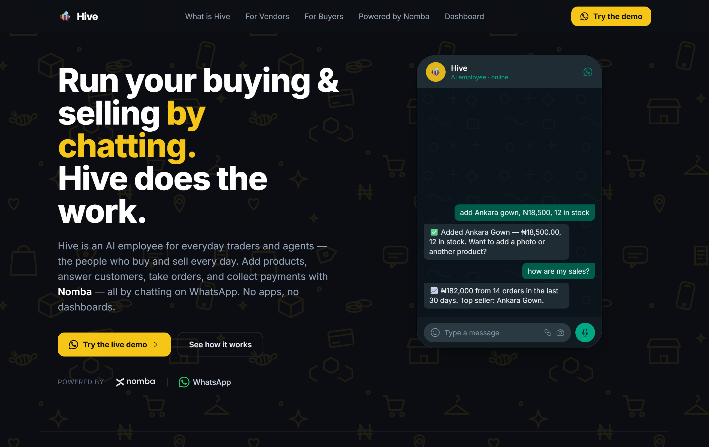
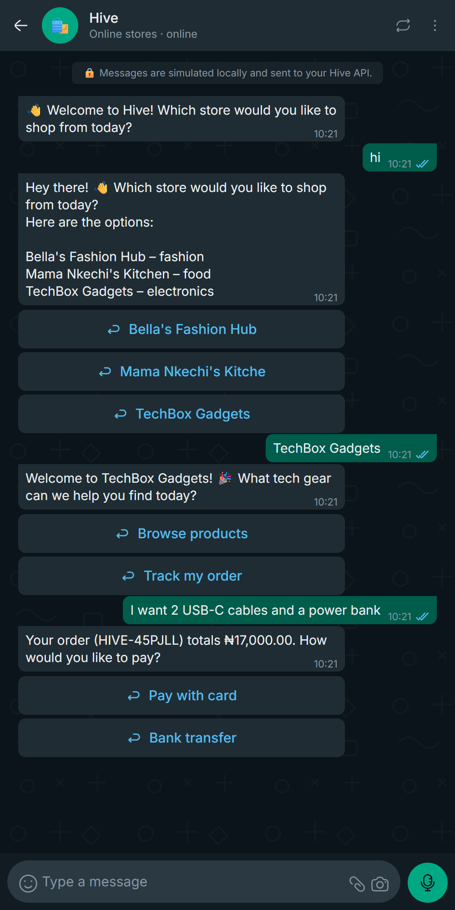
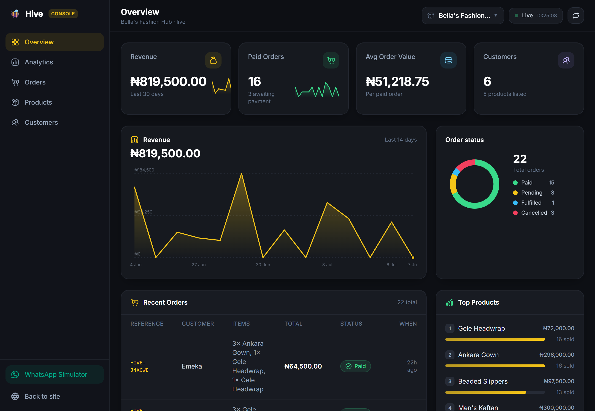

<div align="center">

# 🐝 Hive

### The autonomous AI employee for social commerce — buy and sell entirely by chatting on WhatsApp.

Merchants manage inventory and run their entire store by chatting. Customers discover products, order in plain language, and receive instant confirmations — without ever leaving WhatsApp.

<br/>

[](https://wa.me/14155238886)
[](https://groq.com)
[](https://www.typescriptlang.org/)
[](https://www.prisma.io/)

<br/>



</div>

---

## The Problem

Millions of independent merchants run their entire business through **WhatsApp** — handling orders via DMs, sharing screenshots for product prices, and noting transactions on paper or mental memory. It works, but it hits hard limits:
- **No real-time inventory tracking:** Merchants oversell items or spend hours answering "Is this still available?"
- **Lost orders:** Manual chats lead to forgotten requests and delayed order confirmations.
- **High operational friction:** Existing e-commerce platforms force sellers and buyers to install heavy mobile apps or navigate complex dashboards.

## The Solution

**Hive is an autonomous AI employee living directly in the messaging channel both parties already use.** One WhatsApp number powers both sides of the business:

<table>
<tr>
<td width="50%" valign="top">

### 🛍️ For Sellers

Manage store operations conversationally — no complicated software to learn.

- *"Add Ankara Gown, ₦18,500, 12 in stock"* — or simply **send a product photo** and Hive's AI vision drafts the title and description.
- *"How are my sales?"* → instant breakdown of order volume, revenue, and top products.
- Auto-decrements inventory on orders and restores stock if an order is cancelled.
- Generates structured receipts and logs customer relationship history automatically.

</td>
<td width="50%" valign="top">

### 🛒 For Buyers

Shop effortlessly in the same chat — no account signup, no external app.

- Select a store, browse current stock, and place orders in conversational language.
- Instant order confirmation and receipt generation directly in the chat thread.
- Order tracking, modifications, cancellations, and customer support handled 24/7.
- Smooth natural-language interaction tailored for conversational commerce.

</td>
</tr>
</table>

---

## See It Work

<div align="center">

### Conversational Ordering & Stock Reservation



<sub>A customer browses items, orders in plain language, and gets immediate confirmation with stock reserved in real time.</sub>

<br/><br/>

### Real-Time Merchant Operations Console



<sub>Order volume, revenue metrics, top-selling products, and inventory stock health — updating live as orders are placed.</sub>

</div>

---

## Architecture & Codebase

```
apps/
├── api/                     # Node + Express + TypeScript + Prisma
│   └── src/
│       ├── agent/           # Groq LLM, system prompts, tool function-calling registry, autonomous loop
│       ├── integrations/    # WhatsApp provider layer (Twilio + Meta Cloud API, provider-switched)
│       ├── routes/          # health · chat · whatsapp webhooks · dashboard metrics
│       ├── services/        # merchant · product · customer · order · analytics
│       └── utils/           # money calculations, order references
│
└── web/                     # Vite + React + Tailwind
    └── src/                 # live merchant console + in-browser WhatsApp simulator
```

### The Autonomous Agent Engine

Groq LLMs drive an autonomous function-calling loop equipped with store management tools:
- `add_product`, `update_product`, `adjust_inventory`, `remove_product`
- `place_order` (atomically reserves inventory and generates reference)
- `cancel_order` (atomically replenishes stock and marks order cancelled)
- `fulfill_order`, `check_order_status`, `list_orders`
- `get_analytics`, `get_low_stock`, `list_customers`, `send_promotion`, `raise_support`

When a merchant sends an image, a vision model drafts the product listing automatically.

---

## Quickstart (Local Development)

You can run the **entire commerce and ordering loop** locally with just a PostgreSQL database and a free Groq API key:

```bash
# 1. Install dependencies
pnpm install

# 2. Configure environment
cd apps/api
cp .env.example .env          # Set DATABASE_URL and GROQ_API_KEY
pnpm db:generate              # Generate Prisma client
pnpm db:push                  # Push schema to database
pnpm db:seed                  # Seed demo store "Bella's Fashion Hub"

# 3. Start development servers
cd ../..
pnpm dev:all                  # API → :4000 · Dashboard → :5173 · Simulator → :5173/#/whatsapp
```

### Key Environment Variables

| Variable | Required | Description |
|---|---|---|
| `DATABASE_URL` | Yes | PostgreSQL connection string (local or [Neon](https://neon.tech)). |
| `GROQ_API_KEY` | Yes | Groq API key for LLM inference ([console.groq.com](https://console.groq.com/keys)). |
| `TWILIO_*` / `WHATSAPP_*` | Optional | WhatsApp gateway credentials. When omitted, mock logging is used. |

---

### In-Browser WhatsApp Simulator

Test the full buyer and merchant experiences without needing a live WhatsApp number:
- Launch `pnpm dev:all` and navigate to `http://localhost:5173/#/whatsapp`.
- Switch roles between **Buyer** and **Vendor** to test catalog creation, inventory adjustments, natural language ordering, and live metric updates.

---

## Roadmap

- Direct multi-channel catalogue broadcast (WhatsApp Status & Instagram).
- Automated customer retention campaigns and re-engagement triggers.
- Advanced supply chain re-ordering recommendations based on sales velocity.

<div align="center">
<br/>
<sub>Built with 🐝 for modern social commerce.</sub>
</div>
